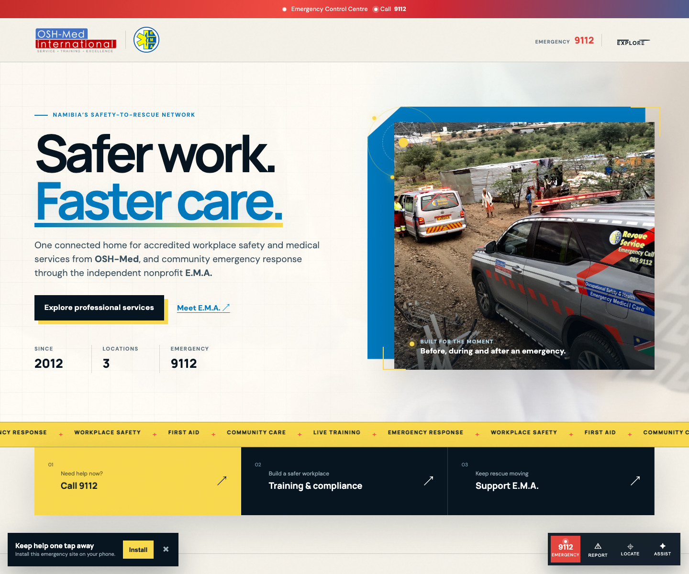
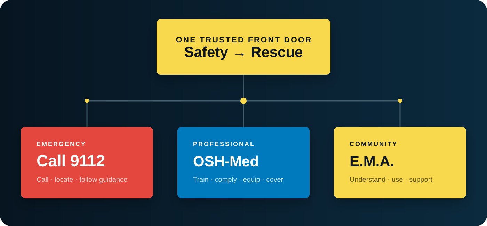

# OSH-Med + E.M.A. Namibia — Archived Concept

> [!IMPORTANT]
> **This unified concept is archived.** E.M.A. Namibia and OSH-Med International are separate organisations with independent live experiences and case studies. The work below is preserved as the historical design record.

| Organisation | Live experience | Current public case study |
| --- | --- | --- |
| **E.M.A. Namibia** — nonprofit emergency care | [ema-namibia.pages.dev](https://ema-namibia.pages.dev/) | [ema-namibia-case-study](https://github.com/freeman-ipumbu/ema-namibia-case-study) |
| **OSH-Med International** — training academy | [osh-med-international.pages.dev](https://osh-med-international.pages.dev/) | [osh-med-international-case-study](https://github.com/freeman-ipumbu/osh-med-international-case-study) |

The former combined URL is retained as a navigation gateway: [oshmed-ema-namibia.pages.dev](https://oshmed-ema-namibia.pages.dev/).

## The brief

Create one unforgettable digital home for two connected but legally distinct missions:

- **OSH-Med International** — professional occupational safety, emergency-care training, medical services and equipment.
- **E.M.A. Emergency & Medical Assistance** — an independent Namibian nonprofit working to make emergency care available to people who cannot afford private ambulance services.

The experience had to do more than modernise two dated websites. It had to reduce confusion, protect emergency access, make professional capability legible, earn donor confidence and show the human reality of the work.

## Strategic decision

One platform, two clearly labelled missions, three immediate paths:

1. **Emergency:** call 9112 without navigating the website.
2. **Professional:** find OSH-Med training, compliance and medical support.
3. **Community:** understand, use and support E.M.A.

This preserves organisational clarity while consolidating maintenance, attention, search authority and public trust.

## Experience system

### Emergency-first UX

- persistent 9112 access in the emergency strip, desktop action dock and mobile action bar
- privacy-preserving browser GPS that creates a map link only when the visitor requests it
- live connection, local time and location-readiness signals
- first-60-second guidance that explicitly defers to the emergency controller
- non-emergency traffic-warning builder linked to E.M.A.’s published WhatsApp reporting line
- installable PWA with essential offline access

### Guided assistance without dangerous theatre

The former “AI chat” pattern was redesigned as **E.M.A. Assist**, a constrained decision guide. It routes visitors to emergency calling, location sharing, traffic reporting, training and support. It does not diagnose, claim to dispatch or collect sensitive medical details.

### A living media platform

- real Kosmos 94.1 audio streaming with user-initiated playback
- COPPS 94.1 and 9-1-1-2 video storytelling
- field-led photography from OSH-Med and E.M.A.’s real work
- kinetic motion, magnetic controls, live indicators and scroll choreography
- reduced-motion support for accessibility and calmer use under pressure

## Research translated into product

The experience incorporates publicly verifiable information from:

- [OSH-Med International](https://www.osh-med.pro/) — services, training, locations and accreditation.
- [E.M.A. Namibia](https://www.ema-organisation.pro/) — 9112, nonprofit purpose, app and public reporting channels.
- [Namibia Daily News](https://namibiadailynews.info/saving-lives-at-the-push-of-a-button-the-year-e-m-a-namibia-transformed-emergency-care/) — reported 2025 impact.
- [NBC Namibia](https://nbcnews.na/index.php/node/116933) — E.M.A.’s European Emergency Number Association membership.
- [Kosmos 94.1](https://www.kosmos.com.na/) — live station stream and COPPS programme context.

## Trust and safety choices

- no simulated live dispatch
- no automated medical diagnosis
- no storage of GPS coordinates or enquiry data by the static site
- clear separation between emergency and non-emergency reporting
- CSP, permission policy, strict referrer policy and immutable asset caching at the edge
- keyboard-accessible tabs, modal guides and navigation
- reduced-motion support and high-contrast emergency controls

## Delivery

- semantic HTML, modern CSS and dependency-light JavaScript
- Cloudflare Pages with production security headers
- offline-capable service worker and web app manifest
- direct, globally distributed static delivery

## Role

Research, positioning, information architecture, UX strategy, art direction, interaction design, frontend engineering, emergency-safety design, PWA implementation, Cloudflare deployment and launch.

An experience by **[SolarSpin Technologies](https://freeman-ipumbu.pages.dev/)**.

> Brand assets and operational imagery remain the property of OSH-Med International and E.M.A. and are shown with permission. The private production source is not included in this public case study.
